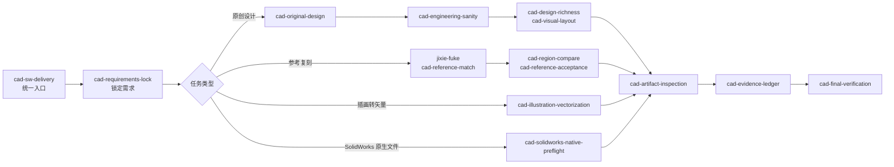

# Mechanical CAD Skills

面向 Codex 的机械 CAD、SolidWorks 与工程图交付 Skill 集群。它把需求锁定、原创设计、参考图复刻、工程合理性检查、原生 SolidWorks 验收和最终交付证据组织成一套可复用流程。

Codex skill collection for mechanical CAD, SolidWorks, engineering drawings, CAD automation, reference matching, and deliverable verification.

> 这些 Skill 提供任务路由、工程检查和验收规则，不包含也不替代 SolidWorks、AutoCAD、FreeCAD 等 CAD 软件。

## 能解决什么问题

- 根据尺寸、接口、载荷和制造约束开展原创机械设计。
- 按参考图、PDF、截图或现有 CAD 文件复刻工程图。
- 检查结构合理性、间隙、壁厚、孔边距、标准件和材料假设。
- 验收 `.SLDPRT`、`.SLDASM`、`.SLDDRW` 等 SolidWorks 原生文件。
- 检查 STEP、DXF、DWG、STL、3MF、GLB 和 PDF 等交付物。
- 生成文件哈希、来源、检查记录和结论状态组成的证据清单。
- 将“看起来不错”拆成可重复执行的局部对比与最终验收步骤。

## 工作流



工具或自动化链路不明确时，先使用 `cad-toolchain-preflight`。吸收外部 Skill、MCP 或 GitHub 工作流前，先使用 `cad-external-skill-intake` 做只读审查。

## Skill 列表

| Skill | 用途 |
| --- | --- |
| `cad-sw-delivery` | 集群统一入口，负责路由、交付流程和结论边界 |
| `cad-requirements-lock` | 在建模前锁定单位、尺寸、约束、标准和验收目标 |
| `cad-original-design` | 无参考图时，从功能与工程约束开展原创设计 |
| `cad-engineering-sanity` | 检查载荷路径、接口、壁厚、孔边距、间隙和材料等合理性 |
| `cad-design-richness` | 检查机械设计是否具备真实功能结构与制造细节 |
| `cad-visual-layout` | 检查工程图视图、线型、标注、标题栏和版面可读性 |
| `cad-toolchain-preflight` | 在使用 SolidWorks、FreeCAD、MCP 或 CAD 脚本前验证工具链 |
| `cad-external-skill-intake` | 只读评估外部 CAD Skill、仓库和自动化方案 |
| `cad-solidworks-native-preflight` | 通过 SolidWorks 本体检查原生文件的打开、重建、特征树和导出状态 |
| `cad-reference-match` | 组织参考图复刻与局部工程区域比对 |
| `jixie-fuke` | 机械制图、装配图和零件图参考复刻入口 |
| `cad-region-compare` | 对参考图与候选输出进行同区域图像比较 |
| `cad-reference-acceptance` | 使用编号网格和局部证据验收参考匹配结果 |
| `cad-illustration-vectorization` | 将照片、插画或 Logo 转成可编辑 SVG/DXF/DWG 线稿 |
| `cad-artifact-inspection` | 只读检查最终文件是否存在、非空及包含可测量内容 |
| `cad-evidence-ledger` | 生成文件哈希、来源、检查项和结论状态清单 |
| `cad-final-verification` | 在宣称“完成”“可交付”前执行最终门禁 |
| `cad-skill-forward-test` | 用场景集前向测试整个 Skill 集群 |

## 快速使用

推荐从总入口开始：

```text
$cad-sw-delivery 检查并交付这个机械装配图。最终需要 DWG、PDF 和可核验的交付记录。
```

也可以直接调用专用 Skill：

```text
$cad-original-design 根据给定安装孔位、载荷和外形限制设计一个可加工支架。

$jixie-fuke 按这张参考图复刻二维装配图，并逐区域比较最终 DWG 导出的 PDF。

$cad-solidworks-native-preflight 验收这些 SLDPRT 和 SLDASM，记录打开、重建、特征树与导出结果。

$cad-artifact-inspection 检查最终 STEP、DXF、DWG、STL 和 PDF 是否有效且非空。
```

## 安装

这些 Skill 当前按项目本地方式组织。将所需目录放入目标项目的 `.codex/skills/`：

```text
your-project/
└── .codex/
    └── skills/
        ├── cad-sw-delivery/
        ├── cad-requirements-lock/
        ├── cad-original-design/
        ├── ...
        └── jixie-fuke/
```

在 PowerShell 中复制完整集群：

```powershell
New-Item -ItemType Directory -Force .\your-project\.codex\skills | Out-Null
Copy-Item -Recurse -Force .\cad-sw-skills\* .\your-project\.codex\skills\
```

每个目录至少包含 `SKILL.md` 与 `agents/openai.yaml`。部分 Skill 还包含 `scripts/` 或 `references/`，复制时应保留完整目录结构。

## 配套脚本

| 脚本 | 作用 | 主要依赖 |
| --- | --- | --- |
| `inspect_cad_artifacts.py` | 检查 CAD、网格和 PDF 交付物 | 标准库；PDF 可选 PyMuPDF，DXF 可选 ezdxf |
| `cad_evidence_manifest.py` | 生成交付证据 JSON | Python 标准库 |
| `compare_regions.py` | 比较参考图与输出的局部区域 | NumPy、Pillow；PDF 输入需要 PyMuPDF |
| `grid_acceptance.py` | 生成网格验收图和逐格指标 | OpenCV、NumPy、Pillow；PDF 输入需要 PyMuPDF |
| `list_forward_scenarios.py` | 浏览集群前向测试场景 | Python 标准库 |
| `validate_cad_skill_cluster.py` | 验证 Skill 结构、互相引用和项目集成规则 | Python 标准库 |

## 验证

在已经集成本 Skill 集群的项目根目录执行：

```powershell
python .\.codex\skills\cad-sw-delivery\scripts\validate_cad_skill_cluster.py
python .\.codex\skills\cad-sw-delivery\scripts\validate_cad_sw_delivery_skill.py
```

当前整体验证器还会检查宿主项目中的 `LOOP.md`、`STATE.md`，以及详细版 `jixie-fuke/SKILL.md`。仅复制 Skill 目录时，Skill 本身仍可读取，但整体验证器会把缺少这些项目级文件报告为集成不完整。

## 验收原则

- 最终结论必须来自最终交付文件，而不是中间脚本、截图或工作源文件。
- “已验证”“推断”和“未验证”必须明确区分。
- STEP、PDF 或截图不能证明 SolidWorks 原生文件可打开、可重建或可编辑。
- 参考图复刻不能只看整页相似度，必须检查编号局部区域。
- 工程外观不能替代尺寸、接口、间隙、材料和制造合理性检查。
- 参考图用于验收时，不应把像素轮廓或采样点直接反向用作机械几何构造依据。

## 目录约定

```text
skill-name/
├── SKILL.md
├── agents/
│   └── openai.yaml
├── scripts/       # 可选：确定性检查或辅助工具
└── references/    # 可选：场景、工具选型或补充资料
```

新增或修改 Skill 后，应先运行集群验证器，再使用 `cad-skill-forward-test` 检查真实任务场景中的路由、证据和结论边界。

## License

当前目录尚未包含 `LICENSE` 文件。在明确许可证之前，本项目未授予复制、修改或再分发许可。
